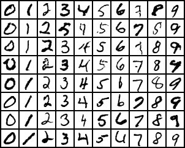
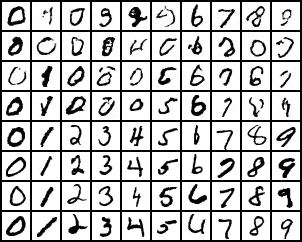
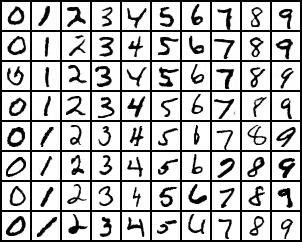
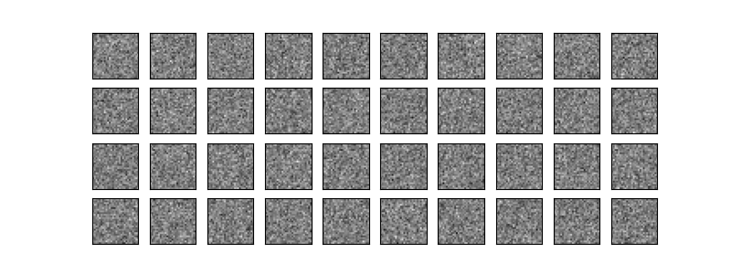
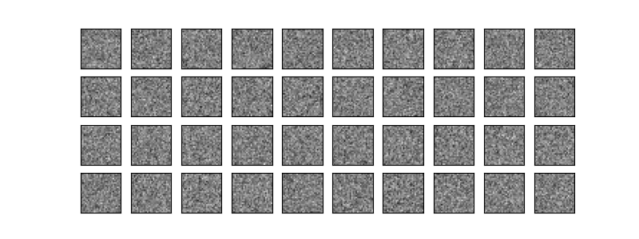
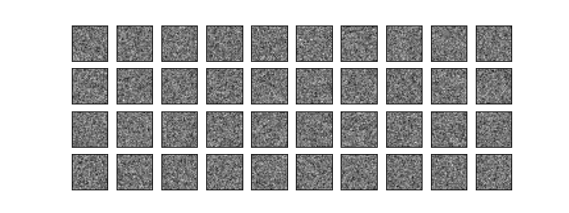

# 基于扩散模型的手写数字图片生成系统

> 本科毕业设计项目

本项目基于 **DDPM（Denoising Diffusion Probabilistic Model）** 实现了一个手写数字图片生成系统。通过条件扩散模型与 U-Net 骨干网络，在 MNIST 数据集上训练，支持用户通过 Web 界面输入数字类别（0-9），生成对应的手写数字图像。

## 功能特性

- **条件生成**：支持指定数字类别（0-9）进行条件图像生成
- **Classifier-Free Guidance**：通过调节引导强度（guidance scale）控制生成质量与多样性
- **Web 可视化界面**：基于 Flask 的 Web 应用，用户可通过浏览器交互式生成图像
- **训练过程可视化**：集成 TensorBoard，实时监控训练损失、学习率和生成样本
- **动态生成过程展示**：保存扩散去噪过程的动画 GIF，直观展示从噪声到图像的生成过程
- **GPU 加速**：支持 CUDA 加速训练和推理

## 系统架构

```
├── model_training/          # 模型训练核心模块
│   ├── unet.py              # U-Net 网络结构
│   ├── diffusion.py         # 扩散过程（前向加噪 + 反向去噪）
│   ├── train.py             # 训练主脚本
│   ├── data_loader.py       # 数据加载器
│   ├── mnist_loader.py      # MNIST 数据集加载工具
│   └── config.py            # 训练配置
├── web_app/                 # Flask Web 应用
│   ├── app.py               # Flask 服务端
│   ├── templates/           # HTML 模板
│   └── static/              # 静态资源（CSS/JS/生成图片）
├── models/                  # 模型权重文件（.pth）
├── samples/                 # 生成样本图片和动画 GIF
├── logs/                    # TensorBoard 日志
├── data/                    # MNIST 数据集
└── setup.py                 # 项目配置与依赖声明
```

## 技术方案

| 模块 | 技术选型 |
|------|---------|
| 深度学习框架 | PyTorch >= 2.0 |
| 模型架构 | U-Net（残差卷积块 + 时间/类别嵌入） |
| 扩散算法 | DDPM，线性 beta 调度，400 步扩散 |
| 数据集 | MNIST 手写数字数据集（28×28 灰度图） |
| Web 框架 | Flask >= 2.0 |
| 训练监控 | TensorBoard |
| 图像处理 | Pillow、torchvision |

### 模型参数

| 参数 | 值 | 说明 |
|------|-----|------|
| `n_feat` | 128 | 基础特征通道数 |
| `T` | 400 | 扩散步数 |
| `batch_size` | 256 | 训练批次大小 |
| `n_epoch` | 201 | 训练轮数 |
| `base_lr` | 1e-4 | 初始学习率 |
| `beta_start` / `beta_end` | 1e-4 / 0.02 | 线性 beta 调度范围 |
| `guidance_scales` | [0.0, 0.5, 2.0] | 分类器自由引导强度 |

## 快速开始

### 环境要求

- Python 3.11（推荐）
- CUDA（可选，用于 GPU 加速）

> 推荐配置：Python 3.11.11 + Conda 环境管理

### 创建 Conda 环境（推荐）

```bash
conda create -n handwritten python=3.11
conda activate handwritten
```

### 安装依赖

```bash
pip install -r requirements.txt
```

### 模型训练

```bash
python -m model_training.train
```

训练过程中会自动：
- 下载 MNIST 数据集
- 每个 epoch 生成样本图片并保存到 `samples/`
- 记录训练日志到 `logs/`（可用 TensorBoard 查看）
- 保存模型检查点到 `models/`

### 启动 Web 应用

```bash
python web_app/app.py
```

浏览器访问 `http://localhost:5000`，即可通过界面输入数字生成手写数字图像。

### TensorBoard 监控

```bash
tensorboard --logdir=logs
```

## 生成效果

不同引导强度下的生成效果对比：

| w=0.0（无条件） | w=0.5（轻微引导） | w=2.0（强引导） |
|:---:|:---:|:---:|
|  |  |  |

扩散去噪过程动画：

| w=0.0 | w=0.5 | w=2.0 |
|:---:|:---:|:---:|
|  |  |  |

## 参考文献

[1] Ho J, Jain A, Abbeel P. Denoising diffusion probabilistic models[J]. Advances in neural information processing systems, 2020, 33: 6840-6851.

[2] Nichol A Q, Dhariwal P. Improved denoising diffusion probabilistic models[C]//International conference on machine learning. PMLR, 2021: 8162-8171.

[3] Rombach R, Blattmann A, Lorenz D, et al. High-resolution image synthesis with latent diffusion models[C]//Proceedings of the IEEE/CVF conference on computer vision and pattern recognition. 2022: 10684-10695.

## 许可证

本项目采用 [MIT 许可证](LICENSE) 开源。
