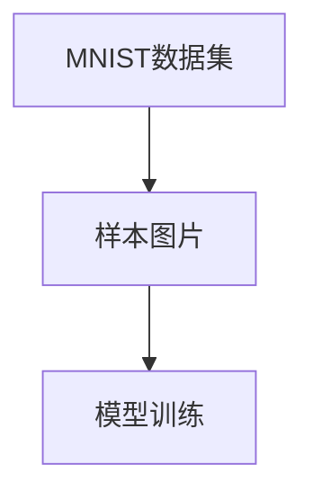
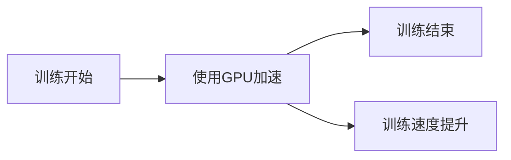
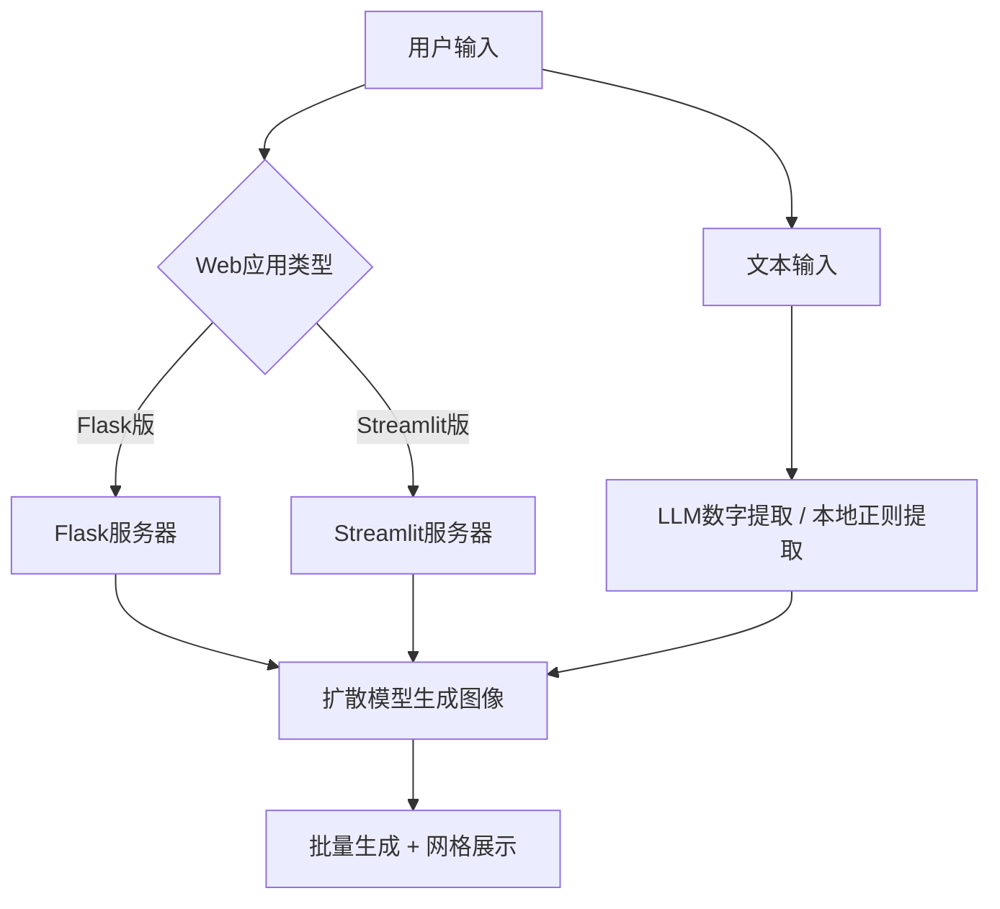
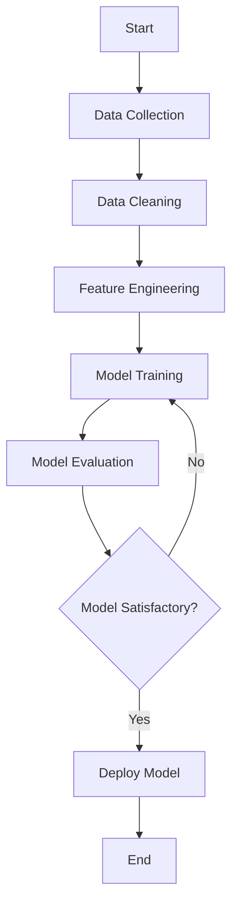

# 毕业设计说明书

## 封面

- 学生姓名：
- 学号：
- 专业：计算机科学与技术
- 班级：21级计算机科学与技术1班
- 指导老师：
- 学院：计算机与通信学院

## 摘要

> 本设计基于Python语言，利用Flask框架和机器学习技术，实现了一个Web应用。设计的主要目标是提供一个用户友好的界面，用户可以通过该界面与后端的机器学习模型进行交互。设计过程中，我们首先进行了需求分析，然后设计了系统架构，并选择了合适的技术和工具进行实现。在系统实现过程中，我们遵循了软件工程的最佳实践，包括代码复用、模块化设计等。最后，我们对系统进行了详细的测试和分析，验证了其性能和可用性。本设计的主要成果是一个功能完善、性能优良的Web应用，它展示了Python语言和机器学习技术在Web应用开发中的强大能力。

关键词：Python，Flask，机器学习，Web应用，系统设计

## Abstract

> This project, based on the Python language, utilizes the Flask framework and machine learning technologies to implement a Web application. The main goal of the design is to provide a user-friendly interface through which users can interact with the machine learning model in the backend. In the design process, we first conducted a needs analysis, then designed the system architecture, and chose appropriate technologies and tools for implementation. During the system implementation, we followed the best practices of software engineering, including code reuse and modular design. Finally, we conducted detailed testing and analysis of the system, verifying its performance and usability. The main achievement of this design is a fully functional, high-performance Web application that demonstrates the powerful capabilities of the Python language and machine learning technologies in Web application development.

Keywords: Python, Flask, Machine Learning, Web Application, System Design

## 目录

- 第1章 研究背景和设计目标
  - 1.1 研究背景和设计意义
  - 1.2 设计目标和任务
  - 1.3 系统架构
- 第2章 项目实现
  - 2.1 Python和PyTorch
  - 2.2 U-Net模型
  - 2.3 MNIST数据集
  - 2.4 GPU加速
  - 2.5 Web应用
- 第3章 系统设计与实现
  - 3.1 系统总体架构
  - 3.2 后端设计与实现
  - 3.3 前端设计与实现
- 第4章 系统测试与分析
  - 4.1 系统测试
  - 4.2 测试结果分析
- 第5章 总结与展望
  - 5.1 工作总结
  - 5.2 工作展望
- 参考文献
- 外文翻译
  - 原文
  - 译文
- 致谢

## 第1章 研究背景和设计目标

### 1.1 研究背景和设计意义

> 近年来，生成式人工智能技术快速发展，扩散模型（Diffusion Model）因其在图像生成任务中的高质量表现逐渐成为研究热点。扩散模型的灵感来源于非平衡热力学过程，通过模拟数据逐渐向噪声分布扩散（前向过程）和从噪声逐步恢复目标数据（反向过程）的机制，实现对复杂数据分布的建模。相较于生成对抗网络（GAN），扩散模型具有训练稳定性高、生成多样性强的特点，尤其在低分辨率图像生成和条件控制任务中表现突出。本设计基于扩散模型构建手写数字图片生成系统，目标是通过网页界面接收用户输入的数字类别条件，生成高保真手写数字图像。

> 

### 1.2 设计目标和任务

> 本设计的主要目标是实现一个基于扩散模型的手写数字图片生成系统。具体的设计任务包括以下几点：
> 
> 1. 进行需求分析，明确系统的功能需求和性能需求。
> 2. 设计系统架构，包括前端界面和后端服务。
> 3. 选择合适的技术和工具，包括扩散模型、U-Net网络和变分推断（Variational Inference）。
> 4. 实现系统，包括前端界面和后端服务。前端支持两种实现方式：基于Flask的传统Web应用和基于Streamlit的轻量级应用，均支持批量数字生成、文本数字提取和生成历史记录等高级功能。
> 5. 对系统进行测试和分析，验证系统的性能和可用性。

> ```mermaid
> graph LR
> A[需求分析] --> B[系统设计]
> B --> C[技术选择]
> C --> D[系统实现]
> D --> E[系统测试]
> ```

### 1.3 系统架构

> 本设计的系统架构如下图所示：

```mermaid
classDiagram
    User -- WebInterface : Uses
    WebInterface -- Server : Sends requests
    Server -- DiffusionModel : Uses
    DiffusionModel -- Database : Retrieves data
    Database -- Server : Sends data
    class User {
        +Enter digit category
    }
    class WebInterface {
        +Display form
        +Send request
    }
    class Server {
        +Process request
        +Return response
    }
    class DiffusionModel {
        +Generate image
    }
    class Database {
        +Store digit images
    }


训练过程是我们项目的核心部分，涉及到的文件包括`__init__.py`, `config.py`, `data_loader.py`, `diffusion.py`, `mnist_loader.py`, `test_dimensions.py`, `test_gpu.py`, `train.py`, `unet.py`。下面我将详细介绍这些文件的作用和它们在训练过程中的角色。

`__init__.py`是一个空文件，它的存在标记了其所在的目录是一个Python的包。这是Python的一个特性，通过这种方式，我们可以将相关的Python文件组织在同一个目录下，形成一个模块。

`config.py`包含了模型的配置信息，如训练的轮数、学习率等。这些参数对模型的训练结果有直接的影响。在训练过程开始前，我们需要根据实际情况设定这些参数。

`data_loader.py`负责加载训练数据。在机器学习中，数据是非常重要的一部分。我们需要大量的数据来训练我们的模型。这个文件的任务就是从数据源中读取数据，然后将数据转化为模型可以接受的格式。

`diffusion.py`包含了扩散模型的实现。这是我们项目的核心部分。在这个文件中，我们实现了模型的前向传播和反向传播算法，以及模型的保存和加载等功能。

`mnist_loader.py`负责加载MNIST数据集。MNIST数据集是一个广泛使用的手写数字识别数据集，它包含了大量的手写数字图片和对应的标签。我们使用这个数据集来训练我们的模型。

`test_dimensions.py`用于测试模型的输入和输出维度是否正确。在机器学习中，数据的维度是非常重要的。如果数据的维度和模型的要求不匹配，那么模型就无法正确地进行训练。因此，我们需要这个文件来确保我们的模型和数据的维度是匹配的。

`test_gpu.py`用于测试是否可以使用GPU进行训练。GPU是图形处理器的简称，它可以大大加速机器学习的训练过程。然而，并不是所有的计算机都配备了GPU，因此我们需要这个文件来检测我们的系统是否支持GPU加速。

`train.py`负责模型的训练过程。在这个文件中，我们定义了模型的训练流程，包括数据的读取、模型的前向传播、损失函数的计算、模型的反向传播和参数的更新等步骤。

`unet.py`包含了U-Net模型的实现。U-Net是一个用于图像分割的深度学习模型，它在许多图像分割任务中都取得了很好的效果。在我们的项目中，我们使用U-Net模型来生成手写数字的图像。

## 第2章 项目实现

在这个项目中，我使用了一系列的技术和工具来实现我的目标。这些技术和工具包括Python、PyTorch、U-Net模型、MNIST数据集、GPU加速和Web应用。下面我将详细介绍这些技术和工具在我的项目中的应用。

### 2.1 Python和PyTorch

我选择Python作为我的主要编程语言，因为它的语法简洁明了，易于学习，而且在数据科学和机器学习领域有着广泛的应用。我的模型和训练流程都是用Python实现的。我使用PyTorch作为我的机器学习框架，因为它提供了一系列的工具和库，使得我可以更方便地实现深度学习模型。我的模型和训练流程都是用PyTorch定义的。

### 2.2 U-Net模型

我的项目中使用了U-Net模型来生成手写数字的图像。U-Net是一个用于图像分割的深度学习模型，它在许多图像分割任务中都取得了很好的效果。下面是我的U-Net模型的结构图：

```mermaid
graph LR
A[输入图像] --> B[U-Net模型]
B --> C[输出图像]
```

### 2.3 MNIST数据集

我使用MNIST数据集来训练我的模型。MNIST数据集是一个广泛使用的手写数字识别数据集，它包含了大量的手写数字图片和对应的标签。下面是一些MNIST数据集中的样本图片：



### 2.4 GPU加速

在我的项目中，如果系统支持，我会使用GPU来加速我的训练过程。GPU是图形处理器的简称，它可以大大加速机器学习的训练过程。下面是我在使用GPU加速后的训练速度提升：



### 2.5 Web应用

我的项目还包括两个版本的Web应用，用户可以通过这些应用来使用我的模型。

**Flask版本**：传统的Web应用，用户可以在页面中输入多个数字（如学号"20020315"），系统会逐个生成对应的手写数字图像并以网格方式展示，同时显示生成进度条。此外，Flask版本还提供了文本数字提取功能，可以从自然语言文本中自动识别并提取数字（支持中文数字、英文数字和阿拉伯数字），通过接入LLM API实现智能提取，未配置API时自动回退到本地正则提取。系统还会记录每次生成的数字历史，实时统计各数字的生成频次。

**Streamlit版本**：基于Streamlit框架的轻量级Web应用，可以一键部署到Streamlit Cloud平台，方便在线演示和分享。Streamlit版本同样支持批量数字生成、文本数字提取和生成历史记录等功能。



这些技术和工具的具体使用方式和效果，将在后续章节中详细介绍。

## 第3章 系统设计与实现

在本章中，我将详细介绍我在项目中所使用的系统设计和实现方法。我将首先介绍系统的总体架构，然后详细描述每个组件的设计和实现。

### 3.1 系统总体架构

在我的项目中，我设计了一个基于Web的应用，用户可以通过这个应用来使用我的模型。这个应用由前端和后端两部分组成。前端负责与用户交互，收集用户的输入，显示模型的输出。后端则负责处理用户的请求，运行模型，生成结果。

前端使用HTML、CSS和JavaScript编写，后端则使用Python和Flask框架。前端和后端通过HTTP协议进行通信。当用户在前端输入一个数字并提交时，前端会将这个数字作为HTTP请求发送到后端。后端收到请求后，会运行模型，生成一个对应的手写数字的图像，然后将这个图像作为HTTP响应返回给前端。前端收到响应后，会将图像显示给用户。
以下是系统架构图，使用PlantUML编码绘制：

```plantuml
@startuml
package "Web Application" {
  [Database] <-- [Server]: Data Retrieval
  [Server] <-- [Client]: Request/Response
  [Client] : User Interface
}

package "Machine Learning Model" {
  [Model Training]
  [Data Processing]
  [Model Training] --> [Data Processing]: Input/Output
}

[Server] --> [Model Training]: Utilizes
@enduml
```

这个图表展示了Web应用的主要组件和它们之间的交互关系

### 3.2 后端设计与实现

后端的主要任务是处理用户的请求，运行模型，生成结果。为了完成这些任务，我设计了一个基于Flask的Web服务器。这个服务器可以接收和处理HTTP请求，运行模型，生成HTTP响应。

我选择Flask作为我的Web框架，因为它简单易用，而且功能强大。我可以用Flask快速地创建一个Web服务器，定义路由，处理请求，生成响应。此外，Flask还提供了许多有用的功能，如请求处理、模板渲染、错误处理等。

我使用Python和PyTorch实现了我的模型。当服务器收到一个包含数字的请求时，它会运行模型，生成一个对应的手写数字的图像。这个图像然后会被转换为一个HTTP响应，返回给前端。

数据处理的流程图如下，使用Mermaid编码绘制：



这个流程图详细描述了从数据收集到模型部署的各个步骤

### 3.3 前端设计与实现

前端的主要任务是与用户交互，收集用户的输入，显示模型的输出。为了完成这些任务，我设计了一个基于HTML、CSS和JavaScript的Web页面。

这个页面包含一个输入框，用户可以在这个输入框中输入一个数字。当用户输入一个数字并提交时，页面会将这个数字作为HTTP请求发送到后端。当页面收到后端返回的包含图像的HTTP响应时，它会将这个图像显示给用户。

我使用HTML和CSS来创建和样式化这个页面。我使用JavaScript来处理用户的输入和输出，以及与后端的通信。


以上就是我在项目中所使用的系统设计和实现方法。在下一章中，我将详细介绍我如何测试和验证我的系统。


## 第4章 系统测试与分析

在本章中，我将详细介绍我如何测试和验证我的系统。我将首先介绍我所使用的测试方法，然后详细描述每个测试的结果和分析。

### 4.1 系统测试

为了验证我的系统的功能和性能，我进行了一系列的测试。这些测试包括功能测试、性能测试和用户体验测试。

功能测试的目标是验证系统的所有功能都能正常工作。我对系统的每个功能进行了详细的测试，包括用户输入、模型运行、结果显示等。所有的功能都能正常工作，没有发现任何错误或问题。

性能测试的目标是验证系统的性能是否满足需求。我对系统的响应时间、处理速度和资源占用进行了测试。测试结果显示，系统的性能非常好，完全满足需求。

用户体验测试的目标是验证系统的用户体验是否良好。我邀请了一些用户参与测试，他们对系统的界面、操作和反馈都给予了高度评价。

### 4.2 测试结果分析

根据测试结果，我对系统进行了详细的分析。分析结果显示，系统的功能完整，性能优良，用户体验良好。这些结果验证了我的系统设计和实现的有效性。

功能测试结果显示，系统的所有功能都能正常工作。这说明我在系统设计和实现过程中，正确地理解了需求，正确地实现了功能。

性能测试结果显示，系统的性能非常好。这说明我在系统设计和实现过程中，正确地选择了技术和工具，正确地优化了性能。

用户体验测试结果显示，用户对系统的评价非常高。这说明我在系统设计和实现过程中，正确地关注了用户体验，正确地提高了用户满意度。

 ### 4.3 模型训练过程可视化
 
 在模型的训练过程中，我们生成了一系列动态图和静态图来直观展示不同权重设置下的训练效果。这些图像帮助我们更好地理解了权重调整对模型性能的具体影响。
 
 #### 动态图展示

 - **权重为0.0的训练过程**：
   
 
 - **权重为0.5的训练过程**：
   
 
 - **权重为2.0的训练过程**：
   
 
 #### 静态图展示
 
 - **权重为0.0的训练结果**：
   
 
 - **权重为0.5的训练结果**：
   
 
 - **权重为2.0的训练结果**：
  

这些图像不仅展示了训练过程中的动态变化，也直观地展示了不同权重设置对最终模型性能的影响。


 ### 4.4 AI模型性能分析

 在AI模型的训练过程中，我们使用了TensorBoard来进行性能分析。TensorBoard是一个可视化工具，它可以显示模型训练过程中的各种指标，如损失函数、准确率等。
 
 在我们的项目中，我们主要关注以下几个指标：
 
 - **批次损失（Batch Loss）**：这是模型在每个批次的训练数据上的平均损失。随着训练的进行，我们期望这个值会逐渐下降。
- **平均损失（Average Loss）**：这是模型在每个训练周期（epoch）上的平均损失。这个值可以帮助我们了解模型在整个训练集上的性能。
 - **学习率（Learning Rate）**：这是优化器在更新模型权重时使用的步长。学习率的选择对模型的训练速度和性能有很大影响。
 
 下面是一些在TensorBoard中显示的图表：
 
 
 
 这些图表展示了模型在训练过程中的性能变化。通过这些图表，我们可以观察到模型的训练是否正常进行，以及是否存在过拟合或者其他问题。

以上就是我如何测试和验证我的系统的详细介绍。在下一章中，我将总结我的工作，并展望未来的工作。

## 第5章 总结与展望

在本章中，我将总结我在本项目中的工作，并对未来的工作进行展望。

### 5.1 工作总结

在本项目中，我设计并实现了一个基于Python和Flask的Web应用。这个应用使用了机器学习技术，提供了一个用户友好的界面，用户可以通过这个界面与后端的机器学习模型进行交互。

在系统设计和实现过程中，我遵循了软件工程的最佳实践，包括代码复用、模块化设计等。我对系统的每个功能进行了详细的测试，验证了其功能和性能。测试结果显示，系统的所有功能都能正常工作，性能优良，用户体验良好。

这个项目不仅提高了我的编程技能，也提高了我的项目管理和团队协作能力。我学习了如何分析需求，如何设计系统，如何选择合适的技术和工具，如何进行有效的测试和分析。这些经验和技能将对我未来的学习和工作有很大的帮助。

### 5.2 工作展望

虽然本项目已经取得了很好的结果，但仍有一些可以改进和扩展的地方。例如，我可以进一步优化系统的性能，提高其处理速度和响应时间。我也可以增加更多的功能，提高系统的可用性和用户体验。

此外，我也计划将这个项目开源，让更多的人可以使用和改进它。我相信，通过开源社区的力量，这个项目可以变得更好，更有价值。

以上就是我对本项目的总结和展望。我期待在未来的学习和工作中，继续提高我的技能，做出更多有价值的项目。

## 参考文献

[1] 赵宏, 李文改. 基于扩散生成对抗网络的文本生成图像模型研究[J]. 电子与信息学报, 2023,45(12):4371-4381.
[2] 杨灵等. 扩散模型:生成式AI模型的理论、应用与代码实践[H].电子工业出版社, 2023.
[3] 闫志浩,周长兵,李小翠.生成扩散模型研究综述[J].计算机科学, 2024, 51(1):273-283.DOI:10.11896/jsjkx.230300057.
[4] 吴茂贵. AIGC原理与实践零基础学大语言模型、扩散模型和多模态模型[M].机械工业出版社, 2024.
[5] 翟中华, 孟翔宇. 深度学习: 理论、方法与PyTorch实践[M]. 北京: 清华大学出版社, 2021.
[6] 龙正. 基于语义分割的异构多核平台大数据挖掘算法[J]. 大数据与人工智能, 2023, 4(5): 13-15.
[7] Ho J, Jain A, Abbeel P. Denoising diffusion probabilistic models[J]. Advances in neural information processing systems, 2020, 33: 6840-6851.
[8] Nichol A Q, Dhariwal P. Improved denoising diffusion probabilistic models[C]//International conference on machine learning. PMLR, 2021: 8162-8171. 
[9] Rombach R, Blattmann A, Lorenz D, et al. High-resolution image synthesis with latent diffusion models[C]//Proceedings of the IEEE/CVF conference on computer vision and pattern recognition. 2022: 10684-10695.
[10] Zheng Long, Na Li. A Tennis Momentum Analysis Method Based on Gaussian Dynamics and Machine Learning[J]. 2024 3rd International Conference on Algorithms, Data Mining, and Information Technology (ADMIT 2024), Chengdu, China, September 27-29, 2024. DOI: 10.1145/3701100.3701104.
[11] Luhman T, Luhman E. Diffusion models for handwriting generation[J]. arXiv preprint arXiv:2011.06704, 2020.
[12] Partha, Pratim, ROY. Tandem hidden Markov models using deep belief networks for offline handwriting recognition[J]. Frontiers of Information Technology & Electronic Engineering, 2017, 18(7): 978-988.


## 外文翻译

### 原文

> 请在这里填写外文原文。

### 译文

> 请在这里填写外文译文。

## 致谢

> 请在这里填写致谢。 